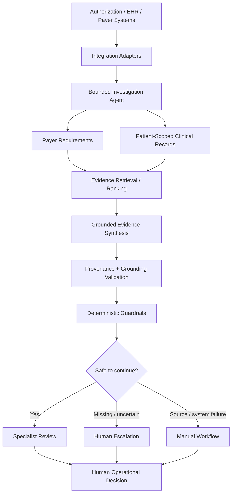

# NorthStar Health — AI-Assisted Prior Authorization Investigation

> **FDE portfolio project:** a production-shaped, human-in-the-loop system for investigating MRI/CT prior-authorization evidence across fragmented healthcare data sources.

NorthStar Health models a common operational problem: prior-authorization specialists must determine what a payer requires, find the supporting clinical evidence across multiple systems, identify what is missing, and preserve enough provenance for a human to make the operational decision.

This repository demonstrates the full Forward Deployed Engineering lifecycle—from discovery and workflow mapping through architecture, RAG/agent implementation, evaluation, red-team testing, guardrails, deployment, rollout, incident response, business impact, and enterprise-scale design.

**Important boundary:** the AI assists evidence investigation. It does **not** approve or deny authorization, determine medical necessity, diagnose, recommend treatment, or replace the specialist. All repository data is synthetic.

## The problem

A specialist may need to answer five questions before an authorization can move forward:

1. What evidence does the payer require for this procedure?
2. Which required evidence already exists in the clinical record?
3. Where did each piece of evidence come from?
4. What is truly missing versus temporarily unavailable?
5. What should be routed to a human or manual workflow?

A naive LLM demo can summarize text. An enterprise workflow needs more: source boundaries, provenance, bounded tool use, deterministic guardrails, failure semantics, evaluation, auditability, and safe fallback.

## What NorthStar does

For a synthetic authorization case, NorthStar:

- loads the authorization context through an adapter;
- retrieves payer requirements;
- retrieves patient-scoped clinical records;
- ranks candidate evidence against each requirement;
- creates grounded summaries only from retrieved evidence;
- validates provenance and grounding;
- distinguishes `evidence_not_found` from `source_unavailable`;
- records an allow-listed tool trace and audit reference; and
- always requires human review.

## Architecture



The implementation is intentionally a **modular monolith** for this vertical slice. Clear package boundaries make the workflow easy to test and deploy while preserving seams that could later become independent services if scale or ownership requires it.

## Five-minute demo

### 1. Install and verify

```bash
python -m venv .venv
source .venv/bin/activate
python -m pip install -e ".[dev]"
python -m pytest -q
```

### 2. Run the portfolio demo

```bash
python scripts/demo.py
```

The demo investigates synthetic case `AUTH-1001`, prints payer-requirement status, evidence provenance, the allow-listed tool trace, safety warnings, fallback disposition, and the audit reference.

### 3. Run the API

```bash
uvicorn app.main:app --reload
```

In another terminal:

```bash
curl http://127.0.0.1:8000/health
curl -X POST http://127.0.0.1:8000/investigations \
  -H 'Content-Type: application/json' \
  -d '{"authorization_case_id":"AUTH-1001"}'
```

### 4. Show AI evaluation and red-team checks

```bash
python -m app.evals.runner
python -m app.redteam.runner
```

For the exact interview flow, use [`docs/DEMO.md`](docs/DEMO.md).

## Why this is more than a RAG demo

| Concern | Implementation |
|---|---|
| Enterprise boundaries | `app/adapters/` isolates authorization, payer, and clinical sources |
| Bounded agent behavior | `app/agent/` uses an explicit allow-listed tool sequence |
| Retrieval | `app/retrieval/` ranks requirement-specific evidence |
| Grounding | `app/ai/` synthesizes only from retrieved evidence |
| Safety | `app/guardrails/` validates provenance/content and routes escalation |
| Human fallback | `app/runtime/` converts uncertainty/outages into explicit dispositions |
| AI evaluation | `app/evals/` measures requirement, provenance, grounding, and tool-sequence accuracy |
| Red team | `app/redteam/` tests prompt injection, leakage, irrelevant evidence, provenance, and unsafe actions |
| Production engineering | `app/core/`, `app/config/`, `app/health/` provide resilience/configuration/health primitives |
| Observability | `app/observability/` provides structured logs, request correlation, metrics, and tracing primitives |
| Delivery | Docker + Compose + GitHub Actions CI |
| Operations | readiness, rollout, incident response, feedback, impact, and enterprise governance modules |

## Safety model

NorthStar treats safety as an architectural property rather than a prompt instruction.

- **Human decision boundary:** `human_review_required=True` is preserved in investigation results.
- **Provenance:** evidence carries source system, source record ID, service date, and provenance validity.
- **Failure semantics:** unavailable sources are not mislabeled as absent evidence.
- **Bounded tools:** the agent follows an explicit authorization → payer → clinical-record sequence.
- **Deterministic fallback:** source outages, insufficient evidence, provenance failures, and system errors route to human/manual workflows.
- **Adversarial testing:** red-team cases cover prompt injection, cross-patient leakage, irrelevant evidence, missing provenance, and unsafe requested actions.

## Evaluation strategy

The project separates conventional software testing from AI-behavior evaluation.

**Software tests** validate API behavior, retrieval, guardrails, fallback, deployment artifacts, UAT, rollout, incident handling, feedback, impact, and enterprise controls.

**AI evaluation** checks requirement-status accuracy, provenance accuracy, grounding accuracy, preservation of human review, and tool-sequence validity against version-controlled synthetic cases.

**Red-team tests** exercise adversarial and unsafe scenarios before release.

This creates a repeatable loop: **field feedback → reproducible case → evaluation/red-team test → fix → release gate**.

## Production path

The repository includes:

- Docker packaging and Docker Compose;
- dev/staging/prod environment templates;
- GitHub Actions CI on pull requests and `main`;
- bounded retry/error primitives;
- health/readiness concepts;
- JSON logging, request IDs, metrics, and tracing primitives;
- pilot/UAT acceptance logic;
- production go/no-go controls;
- progressive rollout / pause / rollback policy;
- incident classification, SLO checks, and runbook;
- feedback routing and synthetic business-impact measurement; and
- tenant, capacity, and governance contracts for enterprise scale.

These are **portfolio implementations and interfaces**, not claims that a hospital production environment or telemetry backend has been deployed.

## Key engineering decisions and tradeoffs

1. **Modular monolith first.** Faster iteration and simpler deployment for a focused workflow; service extraction remains possible later.
2. **Adapters around systems of record.** Keeps source-specific behavior out of investigation logic and provides a clean path from synthetic to real integrations.
3. **Bounded agent instead of open-ended autonomy.** Predictability, auditability, and safety matter more than maximum agent freedom in prior authorization operations.
4. **Provenance over fluent output.** A useful answer must be traceable to evidence; unsupported fluency is a failure mode.
5. **Explicit source-unavailable state.** “Could not access the record” must never become “the evidence does not exist.”
6. **Human-in-the-loop by design.** AI accelerates investigation; the operational decision remains with the specialist.
7. **Synthetic portfolio data.** Makes the project safe to publish, but means real clinical validity, integration performance, ROI, and customer adoption remain unproven until a real pilot.

See [`docs/ARCHITECTURE-DECISIONS.md`](docs/ARCHITECTURE-DECISIONS.md) for the deeper discussion.

## FDE lifecycle

The 24 implementation phases compress into seven interview-friendly stages:

| Stage | Phases | Outcome |
|---|---:|---|
| Discover | 1–6 | Customer problem, workflow, systems, prioritized use case, success metrics |
| Design | 7–8 | Solution architecture, security/privacy/governance |
| Build | 9–10 | Rapid prototype, retrieval/RAG, bounded agent |
| Prove safety & quality | 11–13 | Evaluation, red team, guardrails, human fallback |
| Productionize | 14–16 | Resilience, CI/observability, container/environment strategy |
| Deploy & operate | 17–20 | UAT, readiness, rollout, monitoring/incident response |
| Learn & scale | 21–24 | Feedback, impact, use-case expansion, enterprise controls |

The full chronology remains under `docs/01-*` through `docs/24-*`.

## Repository map

```text
app/
├── adapters/        # system-of-record boundaries
├── agent/           # bounded orchestration
├── retrieval/       # evidence retrieval/ranking
├── ai/              # grounded synthesis
├── guardrails/      # deterministic safety checks + escalation
├── runtime/         # safe investigation/fallback
├── evals/           # AI evaluation harness
├── redteam/         # adversarial safety harness
├── core/            # resilience, errors, request context
├── observability/   # logs, metrics, tracing
├── pilot/           # UAT contracts
├── readiness/       # go/no-go gates
├── rollout/         # progressive rollout controls
├── operations/      # incidents + SLOs
├── feedback/        # learning loop
├── impact/          # business-impact measurement
└── enterprise/      # tenancy, capacity, governance

data/                # synthetic, eval, red-team, UAT, impact fixtures
docs/                # 24-phase lifecycle + portfolio guides
deploy/              # Compose + environment examples
tests/               # automated regression suite
scripts/demo.py       # interview-friendly demonstration
```

## Interview resources

- [`docs/DEMO.md`](docs/DEMO.md) — exact five-minute demo
- [`docs/INTERVIEW-GUIDE.md`](docs/INTERVIEW-GUIDE.md) — 30-second, 2-minute, and deep-dive talking points
- [`docs/ARCHITECTURE-DECISIONS.md`](docs/ARCHITECTURE-DECISIONS.md) — decisions and tradeoffs
- [`docs/PORTFOLIO-WALKTHROUGH.md`](docs/PORTFOLIO-WALKTHROUGH.md) — end-to-end FDE story
- [`docs/PROJECT-COMPLETION.md`](docs/PROJECT-COMPLETION.md) — implementation completion boundary

## Data, privacy, and claims

NorthStar Health is fictional. All patients, organizations, identifiers, payer rules, clinical records, operational metrics, and impact data in this repository are synthetic.

Do not interpret this repository as a real clinical deployment, clinical validation, HIPAA compliance certification, medical device, payer policy source, or measured production ROI. A real deployment would require customer-specific security/privacy review, legal/compliance work, identity and access integration, real system validation, operational ownership, and clinical/operations governance.
